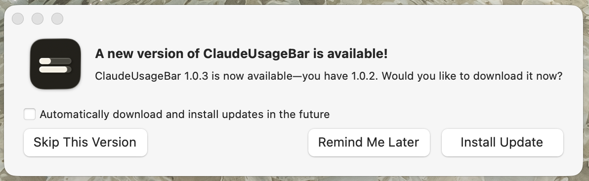
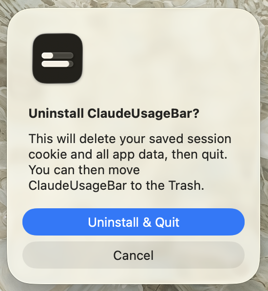

# ClaudeUsageBar

A native macOS menu bar app that shows your Claude subscription usage at a glance. 


Built with [Swift](https://www.swift.org/), [AppKit](https://developer.apple.com/documentation/appkit) and [Sparkle](https://sparkle-project.org/) for automatic updates. Open source under the [MIT License](LICENSE).

Note that this is for **claude.ai subscribers only** (Free, Pro, Max, Teams), it does not work with Anthropic API usage. 

## Problem statement
Claude subscribers have no at-a-glance way to know how much of their usage limit they've consumed. The only way to check is to navigate to the browser or the Claude app, open settings, find the usage page, and refresh as they work. This is a multi-step interruption that disrupts most people's workflows or surprises them when they accidentally hit their limit mid-conversation.

This is a pain point for power users conscious of their usage throughout the day. The app is a quick visual solution to the problem.

ClaudeUsageBar puts your current session and weekly usage always visible in the macOS menu bar. With one click, you can expand the app to show you more details about your usage. 

## What it does

### Quickview
In the menu bar, it displays:
- **Usage** in % for the current session. If current session has not started, weekly session % is shown.
- **Time** till the current session resets.

### Dropdown
- **Current session**: Percentage bar of current session used and time until reset.
- **Weekly session**: Percentage bar of weekly limit used and time until reset.
- **Updated at**: Timestamp of when it last auto-refreshed. 
- **Refresh**: Button to pull fresh data on demand.
- **Check for updates**: Button to check for ClaudeUsageBar app updates.
- **Set session cookie**: Button to manually set your Claude session cookie.
- **Open usage page**: Button to open the official Claude usage page in the browser.
- **Uninstall ClaudeUsageBar**: Button to get rid of the app. 
- **Quit ClaudeUsageBar**: Button to spare the app from labour.

## Requirements
- An Apple desktop or laptop.
- macOS 14 (Sonoma) or later.
- A Claude account with any subscription: Free, Pro, Max, or Teams

## Install

1. Download `ClaudeUsageBar-x.x.x.dmg` from the [latest release](../../releases/latest)
2. Open the DMG and drag **ClaudeUsageBar** to your Applications folder
3. Open the app

There is no Dock icon, it's menu-bar only.

### ⚠️ Gatekeeper warning on first launch

I know it feels super sus, but because ClaudeUsageBar is not notarised with Apple, macOS will block it on first launch. If you would like to sponsor the notarisation, please contact me.

#### Gatekeeper blocked dialog


Click **Done** (not Move to Bin). Then open **System Settings → Privacy & Security** and scroll down. Here are all known confirmation stages it will throw:

#### System settings


Click **Open Anyway**. A second confirmation appears:

#### Open anyway confirmation


Click **Open Anyway** again, then authenticate with Touch ID or your password:

#### Touch ID or password prompt


You only need to do this once, macOS remembers your choice.

Shortcut: Right-click (or Control-click) the app in Finder → **Open** to skip straight to the confirmation dialog.

## First launch

A setup window will appear asking for your Claude session cookie:

1. Open [claude.ai](https://claude.ai) in your browser and sign in.
2. Open the cookie inspector for your browser:
   - **Chrome**: **⌥⌘I** → **Application** tab → **Cookies** → `https://claude.ai`
   - **Safari**: Enable Web Inspector first (Settings → Advanced → Show features for web developers), then **⌥⌘I** → **Storage** tab → **Cookies** → `claude.ai`
3. Find the cookie named `sessionKey` and copy its value
4. Paste it into the setup window → **Connect**

The cookie is saved to your macOS Keychain. Once connected the app polls every 5 minutes automatically.

### Keychain access prompt

On first run, macOS will ask for permission to access the Keychain:


Click **Always Allow**. This grants the app permanent access to its own cookie and prevents the prompt from appearing again on every refresh.

### Cookie expiry

Your session cookie expires when you log out of Claude or after extended inactivity. When this happens the menu bar will show a warning. To reconnect:
1. Log into [claude.ai](https://claude.ai) in your browser to get a fresh session
2. Click the menu bar item → **Set session cookie…** → paste the new value → **Save**

## Updating

The app checks for updates automatically via Sparkle. When a new version is available, you'll see an in-app prompt:



Click **Install Update** and it handles the rest.

> **Note:** After updating, macOS may prompt for your Keychain password once. Click **Always Allow** to prevent it appearing again.

## Uninstalling

Click the menu bar item → **Uninstall ClaudeUsageBar**. This deletes your saved session cookie and all app data, then quits. You can then drag the ClaudeUsageBar icon in Applications to the Trash.



## Build from source

```bash
git clone https://github.com/patriciagoh/claude-usage-bar
cd claude-usage-bar
```

**For local development** (fast, no DMG):
```bash
make run
```
Builds a debug bundle and launches it in your menu bar. Rebuilds in ~1s on subsequent runs. Sparkle auto-update is disabled in debug builds.

**To build a release DMG** (requires `brew install create-dmg`):
```bash
make app VERSION=dev
open .build/ClaudeUsageBar.app
```
Also runs the full test suite before building.

## What this app accesses

| Resource | Why | When |
|---|---|---|
| macOS Keychain (`com.patriciagoh.ClaudeUsageBar`) | Store and read your session cookie | Read at each refresh, written only when you paste a new cookie |
| Chrome/Safari cookie store (opt-in only) | Read your session cookie automatically | Only when Chrome or Safari mode is chosen in setup |
| `claude.ai/api/organizations` | Discover your organisation ID | Once, on first successful connection |
| `claude.ai/api/organizations/{id}/usage` | Fetch usage percentage and reset date | Every 5 minutes |

By default, the app does not access your browser. If you choose Chrome or Safari mode during setup, it will read that browser's cookie store to obtain your session automatically:
- Chrome: Reads the cookie database and a Keychain item.
- Safari: Reads ~/Library/Cookies/Cookies.binarycookies and requires Full Disk Access. 

Please review [SECURITY.md](SECURITY.md) for the full threat model.

**Note:** This app uses an unofficial and undocumented Claude internal API. It may stop working if Anthropic changes their API without notice.

## License

MIT [License](LICENSE).
