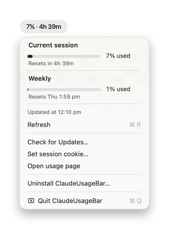
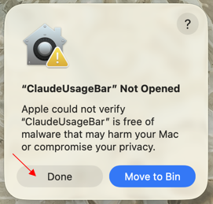
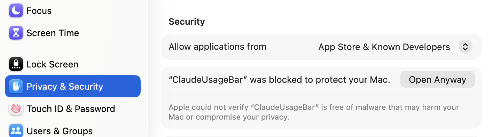
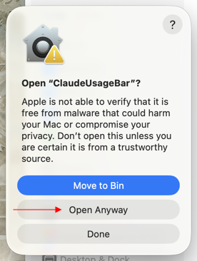
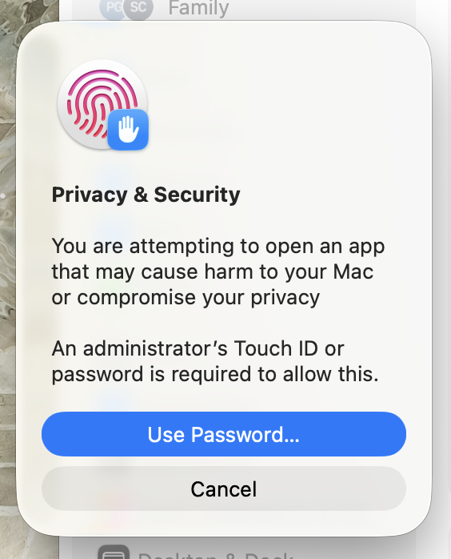
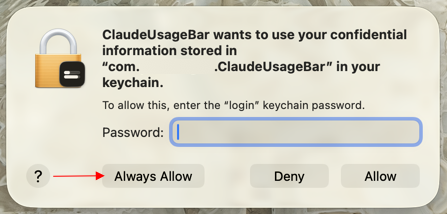

# ClaudeUsageBar

A native macOS menu bar app that shows your claude.ai usage at a glance.



Built with Swift/AppKit, no third-party dependencies except [Sparkle](https://sparkle-project.org/) for automatic updates.

**For claude.ai subscribers only** (Free, Pro, Max, Teams). Does not apply to Anthropic API usage.

## What it shows

- **Current session** — how much of your active session limit you've used, with time until reset
- **Weekly** — how much of your weekly limit you've used, with time until reset
- **Updated at** timestamp and a Refresh button to pull fresh data on demand

## Requirements

- macOS 14 (Sonoma) or later
- A claude.ai account (Free, Pro, Max, or Teams)

## Install

1. Download `ClaudeUsageBar-x.x.x.dmg` from the [latest release](../../releases/latest)
2. Open the DMG and drag **ClaudeUsageBar** to your Applications folder
3. Open the app

### ⚠️ Gatekeeper warning on first launch

Because ClaudeUsageBar is not notarized with Apple, macOS will block it on first launch:



Click **Done** (not Move to Bin). Then open **System Settings → Privacy & Security** and scroll down:



Click **Open Anyway**. A second confirmation appears:



Click **Open Anyway** again, then authenticate with Touch ID or your password:



You only need to do this once — macOS remembers your choice.

**Shortcut:** right-click (or Control-click) the app in Finder → **Open** to skip straight to the confirmation dialog.

## First launch

A setup window will appear asking for your Claude session cookie:

1. Open [claude.ai](https://claude.ai) in your browser
2. Open DevTools: **⌥⌘I** → **Application** tab → **Cookies** → `https://claude.ai`
3. Find the cookie named `sessionKey` and copy its value
4. Paste it into the setup window → **Connect**

The cookie is saved to your macOS Keychain. Once connected the app polls every 5 minutes automatically.

### Keychain access prompt

On first run, macOS may ask for permission to access the Keychain:



Click **Always Allow** — this grants the app permanent access to its own cookie and prevents the prompt from appearing again on every refresh.

### Cookie expiry

Your session cookie expires when you log out of claude.ai or after extended inactivity. When this happens the menu bar will show a warning. To reconnect:
1. Log into [claude.ai](https://claude.ai) in your browser to get a fresh session
2. Click the menu bar item → **Set session cookie…** → paste the new value → **Save**

## Updating

The app checks for updates automatically via Sparkle. When a new version is available you'll see an in-app prompt — click **Update** and it handles the rest.

## Build from source

```bash
git clone https://github.com/patriciagoh/claude-usage-bar
cd claude-usage-bar
make app VERSION=dev
open .build/ClaudeUsageBar.app
```

`make app` requires `create-dmg` (`brew install create-dmg`) and will also run the test suite before building.

No Dock icon — it's menu-bar only.

## What this app accesses

| Resource | Why | When |
|---|---|---|
| macOS Keychain (`com.patriciagoh.ClaudeUsageBar`) | Store and read your session cookie | Read at each refresh; written only when you paste a new cookie |
| Chrome/Safari cookie store (opt-in only) | Read your session cookie automatically | Only when Chrome or Safari mode is chosen in setup |
| `https://claude.ai/api/organizations` | Discover your organisation ID | Once, on first successful connection |
| `https://claude.ai/api/organizations/{id}/usage` | Fetch usage percentage and reset date | Every 5 minutes |

By default the app does not access your browser. If you choose Chrome or Safari mode during setup, it will read that browser's cookie store to obtain your session automatically (Chrome: reads the cookie database and a Keychain item; Safari: reads ~/Library/Cookies/Cookies.binarycookies and requires Full Disk Access). See [SECURITY.md](SECURITY.md) for the full threat model.

> **Note:** this app uses an unofficial, undocumented claude.ai internal API. It may stop working if Anthropic changes their API without notice.

## License

MIT — see [LICENSE](LICENSE)
